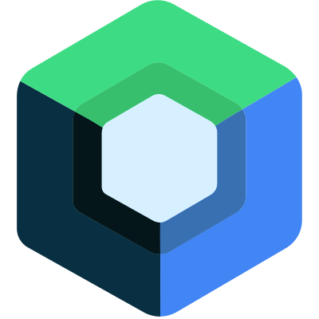
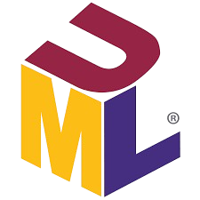
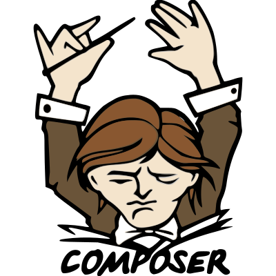

<!-- Olá mensagem de apresentação com animação -->

  

<!-- Foto -->

  

  <a href="https://github.com/joaop0102">
  
  

                                          
        
<!-- Ícones de linguagens -->
<h2 align="center">Linguagens</h2>

   
  
   
  
  
  
  
  
  

<h2 align="center">Frameworks</h2>

  
  
  
  
  

<h2 align="center">Ferramentas</h2>

  
  
  
  
  
  

     

 
  <h2 align="center">Contato</h2>
  

  
  

